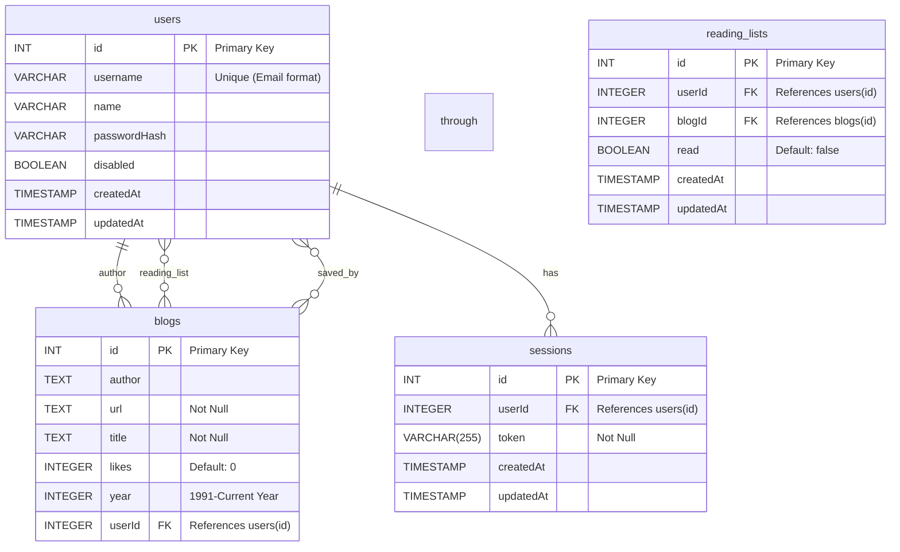

# Data Base Diagram

```mermaid
  erDiagram
    users ||--o{ blogs : "author"
    users ||--o{ sessions : "has"
    users }o--o{ blogs : "reading_list" through reading_lists
    blogs }o--o{ users : "saved_by" through reading_lists

    users {
        INT id PK "Primary Key"
        VARCHAR username "Unique (Email format)"
        VARCHAR name
        VARCHAR passwordHash
        BOOLEAN disabled
        TIMESTAMP createdAt
        TIMESTAMP updatedAt
    }
    
    blogs {
        INT id PK "Primary Key"
        TEXT author
        TEXT url "Not Null"
        TEXT title "Not Null"
        INTEGER likes "Default: 0"
        INTEGER year "1991-Current Year"
        INTEGER userId FK "References users(id)"
    }
    
    reading_lists {
        INT id PK "Primary Key"
        INTEGER userId FK "References users(id)"
        INTEGER blogId FK "References blogs(id)"
        BOOLEAN read "Default: false"
        TIMESTAMP createdAt
        TIMESTAMP updatedAt
    }
    
    sessions {
        INT id PK "Primary Key"
        INTEGER userId FK "References users(id)"
        VARCHAR(255) token "Not Null"
        TIMESTAMP createdAt
        TIMESTAMP updatedAt
    }
```
