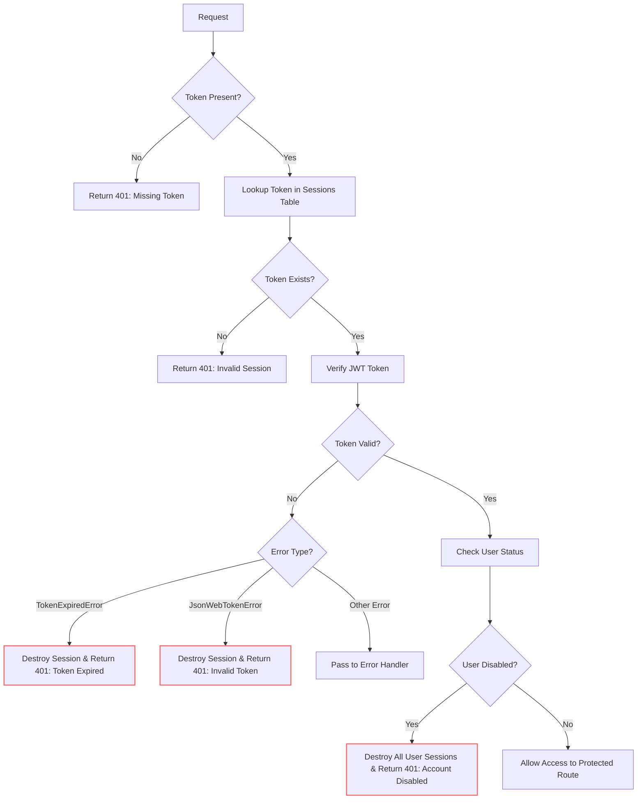

# Session Validation Flow with Token Expiration

```mermaid
  graph TD
    A[Request] --> B{Token Present?}
    B -->|No| C[Return 401: Missing Token]
    B -->|Yes| D[Lookup Token in Sessions Table]
    D --> E{Token Exists?}
    E -->|No| F[Return 401: Invalid Session]
    E -->|Yes| G[Verify JWT Token]
    G --> H{Token Valid?}
    H -->|No| I{Error Type?}
    I -->|TokenExpiredError| J[Destroy Session & Return 401: Token Expired]
    I -->|JsonWebTokenError| K[Destroy Session & Return 401: Invalid Token]
    I -->|Other Error| L[Pass to Error Handler]
    H -->|Yes| M[Check User Status]
    M --> N{User Disabled?}
    N -->|Yes| O[Destroy All User Sessions & Return 401: Account Disabled]
    N -->|No| P[Allow Access to Protected Route]

    style J stroke:#f66,stroke-width:2px
    style K stroke:#f66,stroke-width:2px
    style O stroke:#f66,stroke-width:2px
```
